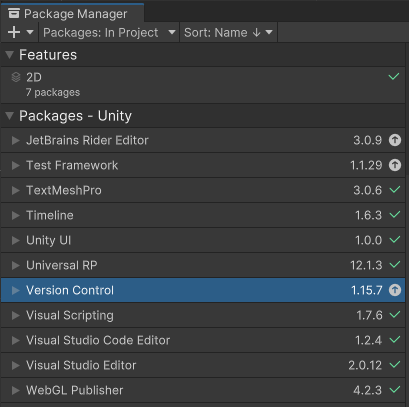
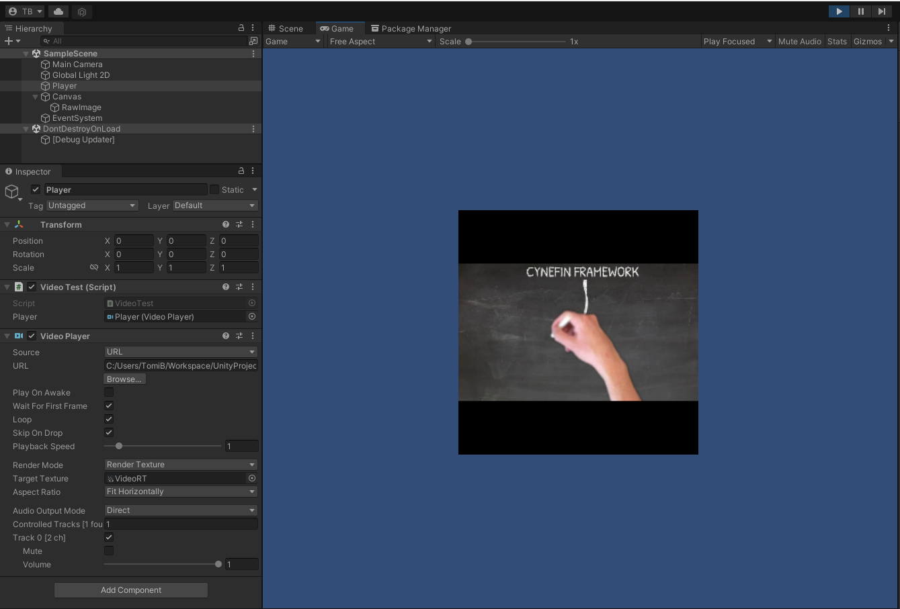
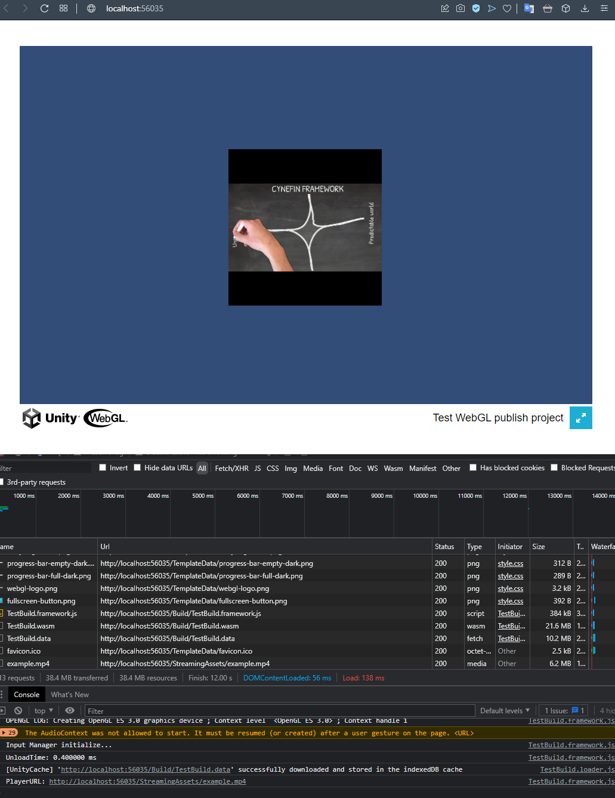
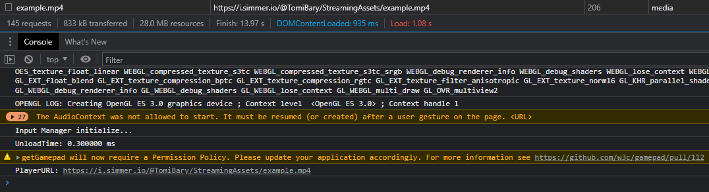

# UnityWebGLPublisherTest
Simple project for testing WebGL Publisher package

In scene is Player object that has VideoPlayer component and [VideoTest.cs](Assets/VideoTest.cs) script  
Script just combine path `Path.Combine(Application.streamingAssetsPath,"example.mp4")` And then sets it to VideoPlayer.url

### Local build   
runs as expected - no errors and successfully loads from Streaming assets (see screenshot below)
Build is included in repository: [Build.zip](UnityWebGLPublisherTest(Build).zip)

### Simmer.io  
Reason of error looks to be, that Unity build is looking for StreamingAssets on wrong URL
[Link](https://simmer.io/@TomiBary/unitywebglpublishertest)

### Unity play
Errors in the console
[Link](https://play.unity.com/mg/other/unitywebglpublishertest)

## Using
**Opera 83.0.4254.19**, **Unity 2021.2.8f1** and packages show below in screenshot  

### Package Manager Screenshot  

### Editor Screenshot  

### Local Build Screenshot  

### Simmer.io bad URL  
Should be: [https://simmercdn.com/unity/GgIvhwl8OeNukE6mrA2JxXfP2kn1/content/c6a85032-f745-bae8-6dd8-8e97ea26b1e6/StreamingAssets/example.mp4](https://simmercdn.com/unity/GgIvhwl8OeNukE6mrA2JxXfP2kn1/content/c6a85032-f745-bae8-6dd8-8e97ea26b1e6/StreamingAssets/example.mp4)  

